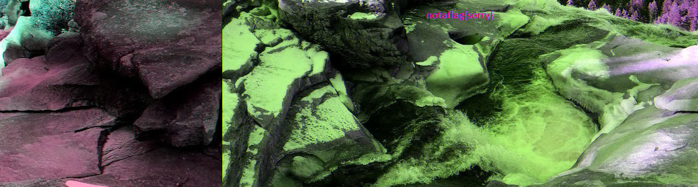
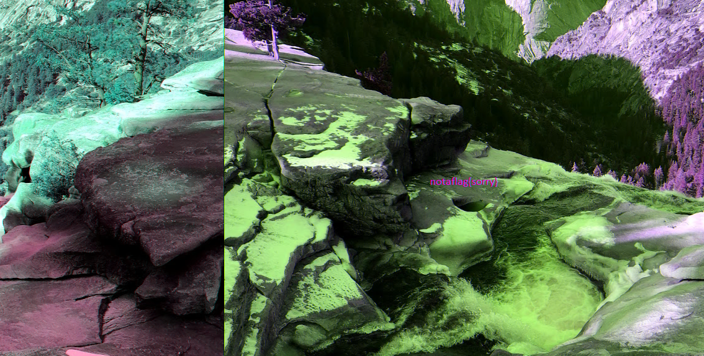
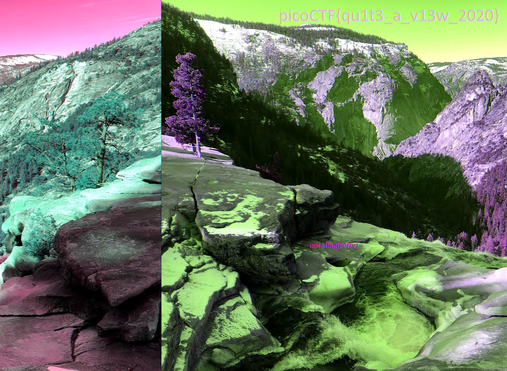

# 1. m00nwalk
Decode this [message](../assets/message.wav) from the moon.

## Solution:
- Open the given link, which downloads an audio file.
- The given hints point us in the correct direction. The first research about the Apollo 11 moon landing's video transmission shows the technology at use: SSTV.
- Search google for any possible SSTV decrypters.
- Use a free online SSTV decrypter reveals an image file.
- This file has the flag.


## Flag:

```
picoCTF{beep_boop_im_in_space}
```

## Concepts learnt:
- SSTV usage for image transfer.
- Various 'encoding' types for SSTV.

## Notes:
- Alternate tangent 1: Tried to analyse a histogram of the wav file.
- Alternate tangent 2: Tried to analyse waveforms of the wav file.

## Resources:
- Scottie Explanation (https://radio.clubs.etsit.upm.es/blog/2019-08-10-sstv-scottie1-encoder/)
- SSTV in the Moon Landing (https://www.scopeofwork.net/how-slow-scan-tv-shaped-the-moon/)
- SSTV decryption (https://hxp1.pythonanywhere.com/)

# 2. tunn3l v1s10n
We found [this](../assets/tunn3l_v1s10n) file. Recover the flag.
Hint 1: Weird that it won't display right...

## Solution:
- First, I downloaded the file. It again did not have a file extension.
- I used resource 1 to check the opening bits of the file. By further search, this file was confirmed to be bm bitmap format.
- Since bitmaps are representations of pictures, I searched for a bitmap to image converter to convert the file into a .jpg image.
- The converter worked, but only had a placeholder garbage value called notaflag{sorry}.



- So, I needed to manipulate the original file. Since there are no other files and the hint seems to be related to the conversion thats already done, the flag must be in the image.
- I zoomed into the image and tried finding hidden text, but found nothing.
- Then, searching online for methods to hide information in images suggested several methods like exiftools, binwalk, colour grading and saturation chnages and header edits.
- I tried many methods but none worked. Binwalk seemed to glitch when I attempted to use it. So, I turned to header editing.
- When I imported the image into a hexeditor, it showed that the format was 12.4% mp3. So, the converter had somehow corrupted the file somewhat.
- So, I opened the original bitmap in the hex editor.
- Changing the width kept corrupting the file. So, I switched to height.
- I found the height pixels and set them from 300 pixels to 400, 450, 500 and so on.
- At 850 pixels the file got corruptedso I tried from 810 onward.
- I saw the flag at 830 pixels.

Image at 820 pixel height:


Flag at 830 pixel height:


## Flag:

```
picoCTF{qu1t3_a_v13w_2020}
```

## Concepts learnt:
- Hex values and headers.
- File conversion corruption.
- Soft crop images using header manipulation to hide information.
- Leading bits identification.
- Hex editing and information location.

## Notes:
- Alternate tangent 1: Zooming and using OCR tools.
- Alternate tangent 2: Import into photoshop, binwalk to look for any hidden layers.
- Alternate tangent 3: Uncrop using photoshop.
- Alternate tangent 4: Change brightness, contrast and saturation to reveal text.
- Alternate tangent 5: Try a QR scanner for hidden text.

## Resources:
- File leading bits checker (https://hexed.it/)
- Leading bits identification index (https://en.wikipedia.org/wiki/List_of_file_signatures)
- Information aboyt bitmaps (https://en.wikipedia.org/wiki/Bitmap)
- bm to jpg converter (https://online.reaconverter.com/)
- Information hiding using hex (https://cyberhacktics.com/hiding-information-by-changing-an-images-height/#:~:text=Steps,net%20via%20your%20web%20browser).)
- Bitmap header information (https://en.wikipedia.org/wiki/BMP_file_format#:~:text=The%20first%202%20bytes%20of,least%2Dsignificant%20byte%20first).&text=The%20header%20field%20used%20to,same%20as%20BM%20in%20ASCII.)

# 3. Trivial Flag Transfer Protocol
Figure out how they moved the flag.

## Solution:
- Download the pcapng file and open it in wireshark to see details.
- Immediately, I spot an instructions.txt among the top few entries.
- Export it using File -> Export objects -> tftp.
- Found the contents and ran them through a cipher checker to determine ROT13 used.
- Reversed the ROT13 to get the message. "TFTP doesn't encrypt our traffic so we must disguise our flag transfer. Figure out a way to hide the flag and I will check back for the plan."

```
GSGCQBRFAGRAPELCGBHEGENSSVPFBJRZHFGQVFTHVFRBHESYNTGENAFSRE.SVTHERBHGNJNLGBUVQRGURSYNTNAQVJVYYPURPXONPXSBEGURCYNA
TFTPDOESNTENCRYPTOURTRAFFICSOWEMUSTDISGUISEOURFLAGTRANSFER.FIGUREOUTAWAYTOHIDETHEFLAGANDIWILLCHECKBACKFORTHEPLAN
```

- Now, I try to find any plan and find another file with more ROT13 encrypted text. Decoding it we get "I used the program and hid it with - due diligence. Check out the photos."

```
VHFRQGURCEBTENZNAQUVQVGJVGU-QHRQVYVTRAPR.PURPXBHGGURCUBGBF
IUSEDTHEPROGRAMANDHIDITWITH-DUEDILIGENCE.CHECKOUTTHEPHOTOS
```

- Now, I turn to 3 photos of the .bmp format for furthur progress.
- Installed binwalk for easy data access in the images.
- Used cp to transfer the pictures from Windows to WSL.
- Since picture2.bmp is 36 mb while the others are less than 1mb, I ran binwalk on that because I have used binwalk before.
- With no readable results, I used binwalk on all 3.
- Then, searching online proved that .bmp cannot have layers. So, flag cannot be in any other layers.
- I turned to another file in the pcapng called program.deb. This is a debian file installer.
- I used commands to check the file. It was steghide.

```sh
crownless@LAPTOP-6K42D1CN:~$ cp /mnt/c/Users/DEBROOP/Downloads/program.deb ~/
crownless@LAPTOP-6K42D1CN:~$ dpkg-deb --info program.deb
 new Debian package, version 2.0.
 size 138310 bytes: control archive=1250 bytes.
     826 bytes,    18 lines      control
    1184 bytes,    17 lines      md5sums
 Package: steghide
 Source: steghide (0.5.1-9.1)
 Version: 0.5.1-9.1+b1
 Architecture: amd64
 Maintainer: Ola Lundqvist <opal@debian.org>
 Installed-Size: 426
 Depends: libc6 (>= 2.2.5), libgcc1 (>= 1:4.1.1), libjpeg62-turbo (>= 1:1.3.1), libmcrypt4, libmhash2, libstdc++6 (>= 4.9), zlib1g (>= 1:1.1.4)
 Section: misc
 Priority: optional
 Description: A steganography hiding tool
  Steghide is steganography program which hides bits of a data file
  in some of the least significant bits of another file in such a way
  that the existence of the data file is not visible and cannot be proven.
  .
  Steghide is designed to be portable and configurable and features hiding
  data in bmp, wav and au files, blowfish encryption, MD5 hashing of
  passphrases to blowfish keys, and pseudo-random distribution of hidden bits
  in the container data.
```
- steghide reveals hidden files placed insise images. So, I read some tutorials on using steghide.
- After the tutorial, I also noticed the previous use of "due diligence" after a hyphen, ie, "I hid it with - due diligence". So, i used due diligence as the passphrase. First with spaces and in "", then together, and then in all caps.
- Since picture2.bmp was the largest, I used steghide on that with no results. picture3.bmp had the flag.
- Picture3 put the flag in a text file, which I read using cat.

```sh
crownless@LAPTOP-6K42D1CN:~$ steghide extract -sf picture2.bmp
Enter passphrase:
steghide: could not extract any data with that passphrase!
crownless@LAPTOP-6K42D1CN:~$ steghide extract -sf picture1.bmp
Enter passphrase:
steghide: could not extract any data with that passphrase!
crownless@LAPTOP-6K42D1CN:~$ steghide extract -sf picture3.bmp
Enter passphrase:
wrote extracted data to "flag.txt".
crownless@LAPTOP-6K42D1CN:~$ cat flag.txt
picoCTF{h1dd3n_1n_pLa1n_51GHT_18375919}
```

## Flag:

```
picoCTF{h1dd3n_1n_pLa1n_51GHT_18375919}
```

## Concepts learnt:
- Reading pcapng using Wireshark, and exporting documents and images.
- ROT13 encryption and decryption.
- Basic linux program installation.
- Basic steganography principles.
- Steghide and its uses.

## Notes:
- Alternate tangent 1: Binwalk to look for any hidden layers.

## Resources:
- Export objects from Wireshark (https://www.youtube.com/watch?v=Fn__yRYW6Wo&t=1s)
- Encryption identifier (https://www.dcode.fr/cipher-identifier)
- ROT13 decoder (https://cryptii.com/pipes/rot13-decoder)
- Image analysis help (https://infosecwriteups.com/beginners-ctf-guide-finding-hidden-data-in-images-e3be9e34ae0d)
- Debian installer checker (https://askubuntu.com/questions/642665/how-to-inspect-and-validate-a-deb-package-before-installation)
- .deb install (https://askubuntu.com/questions/40779/how-do-i-install-a-deb-file-via-the-command-line)
- Steghide tutorial (https://www.hackercoolmagazine.com/beginners-guide-to-steghide/)
- Another Steghide tutorial (https://www.hongkiat.com/blog/hide-secret-files-in-images-using-steghide/)
